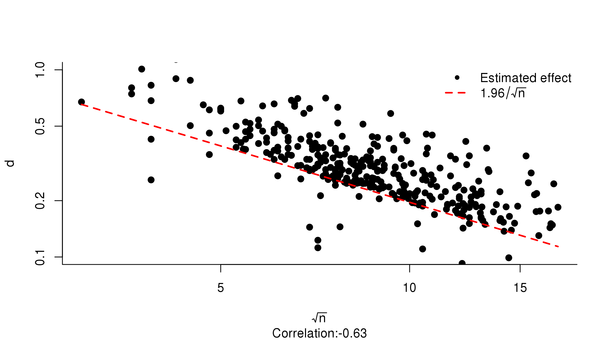

Living with p-hacking
================================================================================
author: Jonas Moss
date: April 19 2018
autosize: true
transition: zoom
transition-speed: slow
navigation: section
width: 1920
height: 1080
font-family: 'Helvetica'
incremental: true


Estimated effect sizes from Motyl et al. (2017)
================================================================================



This is selection for signifance
================================================================================

- Studies with no significant effect are not published.
- Studies with significant effects are obtained through *p-hacking* or the
  "Garden of Forking Paths".
- There is a *significance filter* observed studies are sieved through.
- No satisfactory, general method to analyze data under unknown selection for
  significance.
- Some methods: *PET-PEESE*, *p-curve*, *trim-and-fill*.

Modeling with straussR
================================================================================


```r
formula = z ~ fnormal(log(mean) ~ 1 + year,
                      sd        ~ 1 + year,
                      probit(p) ~ 1 + year + n)

priors = list(mean = list((Intercept) ~ normal(0, 1),
                          year        ~ normal(0, 1)),
              sd   = list((Intercept) ~ gamma(3, 1),
                          year        ~ weibull(2, 3)),
              p    = list((Intercept) ~ normal(0, 1),
                          year        ~ normal(0, 1),
                          n           ~ gumbel(0, 1)))

straussR(formula = formula, data = data, priors = priors)
```

* Plenty of families to choose from, each parameter regressable.
* All unbounded, positive and unit interval priors from `STAN` supported.
* All standard link functions supported.
* Arguments matched and checked.

Example: Motyl et al. (2016)
================================================================================
* Large number of studies from four psychology journals.
* Taken from 2003/2004 and 2013/2015.
  - Q: Was there any difference in p-hacking? Any difference in effect size
       mean?


Accounting for the filter
================================================================================
Some cases:
 1. Studies with significant effects, two-sided selection.
 2. Studies with significant effects, right-sided selection.
 3. Studies with significant effects, left-sided selection.
 4. Studies with insignificant effects and no sign information.
 5. Studies with insignificant effects and sign information.

Cases 2, 3, 4 needs more information than 1 and 5.
- Need info about the intentions of the study authors.
- 1 and 3 are sometimes from $F$-tests.

Data generating model
================================================================================

$$
\begin{eqnarray*}
z_{i}\mid n_{i},\theta_{i},c_{i},C_{i}=b_{a} & \sim & pFN_{|\geq c_{i}}\left(\sqrt{n_{i}}\theta_{i},1\right)+\left(1-p\right)FN\left(\sqrt{n_{i}}\theta_{i},1\right)\\
z_{i}\mid n_{i},\theta_{i},c_{i},C_{i}=b_{r} & \sim & pN_{|\geq c_{i}}\left(\sqrt{n_{i}}\theta_{i},1\right)+\left(1-p\right)N\left(\sqrt{n_{i}}\theta_{i},1\right)\\
z_{i}\mid n_{i},\theta_{i},c_{i},C_{i}=b_{l} & \sim & pN_{|\leq c_{i}}\left(\sqrt{n_{i}}\theta_{i},1\right)+\left(1-p\right)N\left(\sqrt{n_{i}}\theta_{i},1\right)\\
z_{i}\mid n_{i},\theta_{i},c_{i},C_{i}=g_{a} & \sim & FN\left(\sqrt{n_{i}}\theta_{i},1\right)\\
z_{i}\mid n_{i},\theta_{i},c_{i},C_{i}=g & \sim & N\left(\sqrt{n_{i}}\theta_{i},1\right)
\end{eqnarray*}
$$

Distribution of effect size and p.
================================================================================
* The effect sizes are drawn from a population-specific effect size
  distribution.
* Ideal formulation is a complete regression.
* Effect size: $\theta_{i}\mid X_{i}^{\mu},X_{i}^{\sigma},\beta^{\mu},\beta^{\sigma}\sim F\left(\mu_{i},\sigma_{i}\right)$
  - Think meta-analysis with different characteristics.
  - E.g. effect of increased teacher education increases with the proportion
    of high SES students in the classroom.
  - F can be e.g. normal, Gumbel, gamma, inverse gaussian. A constant is also
* p-hacking probabiltiy: $p_{i}\mid X_{i}^{\mu^{p}},X_{i}^{\sigma^{p}},\beta^{\mu^{p}},\beta^{\sigma^{p}}\sim\textrm{Beta}\left(\mu_{i}^{p},\sigma_{i}^{p}\right)$
  - Beta is the absolute monarch of these things.

Use cases
================================================================================

1. Traditional meta-analysis with or without mediation.
2. Estimating the effect size distribution of a 'field'.
   - Correction of effect size estimates.
   - Estimation of the power distribution and replicability.
   - Power analysis for a new study.
3. Et cetera:
   - Are there small study effects outside of p-hacking / publication bias?
   - Do researchers have reasonable knowledge about effect sizes a priori?
     - Would expect some positive association between $\theta_i$ and $n$.
   - Does p-hacking have a negative relationship with $n$, the sample size?

Competition / innovation
================================================================================
1. Most popular competitor, PET-PEESE, does not work.
2. The *p-curve*, popular in psychology, is inefficient, numerically unstable,
   works only for fixed effect sizes, and gives no uncertainty estimates.
   * Also: *z-curve* with similar failings.
3. Trim-and-fill and related methods don't give real estimates.
4. *Clear* need for a better method.


Current state
================================================================================
* Working on a framework for this, tentatively called `straussR`.
* Implemented in `STAN` and `R`.
* Currently no covariates; gamma and inverse gaussian effect size distribution.
* Currently only gamma priors.
* $p$ is drawn from $\textrm{Beta}(\alpha, \beta)$.

Effect size distribution in psychology
================================================================================
* Motyl et al. (2017) "The State of Social and Personality Science"
* Data from four psychology journals, 2003 - 2004, 2013 - 2014. Key hypothesis
  in their paper: Is things better now than before.
* Contains approximate 600 $t$ and $F$ statistics and 33 covariates.
* A load of uses:
  1.) Give an impression of the effect sizes in psychology: Posterior predictive
      distribution. (About $\mathrm{Exp}(4) with a gamma effect size!).
  2.) Find posterior distribution for individual $theta_i$s from psychology.
  3.) Use the posterior predictive distribution as a "correct" prior (with no
      more info). Use it for e.g. power analysis.
  4.) Find replicability and power distribution.
* Similar data set: the *Reproducibility Project*. ~ 100 studies replicated.
  * Use estimated $theta$s for prediction!
  * Find even better estimates of reproducibility.

A meta-analysis of power posing
================================================================================
* Power posing *p-curve* data set taken from DataColada.
* New data set in *P-curving A More Comprehensive Body of Research on Postural
  Feedback Reveals Clear Evidential Value For “Power Posing” Effects*
* Great case study.
