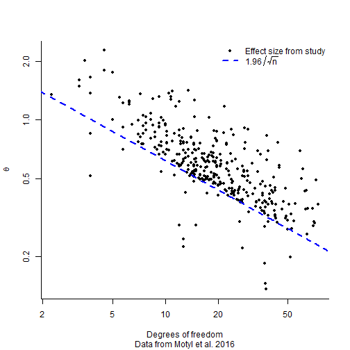
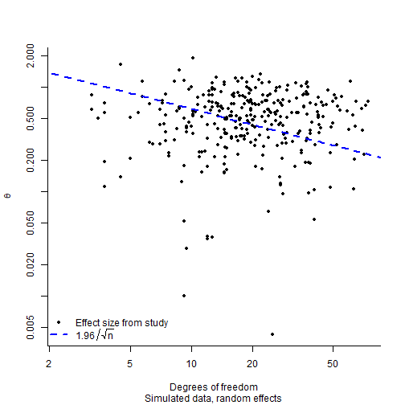
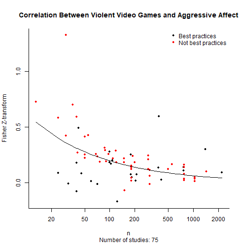

Bayesian Meta-analysis and Publication Bias
========================================================
author: Jonas Moss
date: Mars 2018
autosize: true
transition: zoom
transition-speed: slow
navigation: section
width: 1920
height:1080
font-family: 'Helvetica'

This is what p-hacking looks like!
========================================================

Classical Meta-analysis
========================================================
incremental: true
- Studies $x_i$ are drawn according $x_{i}\sim N\left(\theta_{i},1/\sqrt{n}\right)$
  - $\theta_{i}$ are normalized -- they are *effect sizes*.
  - Fixed effects: $\theta_i = \theta$ for all $i$.
  - Random effects: $\theta_i \sim N(\theta_0, \sigma_0^2)$
- The studies are usually closely related:
  - Effect of a class of anti-depressiva;
  - effect of some psychological intervention.

Classical Meta-analysis: What happens to the plot?
========================================================

- Random effects with $\theta_0 = 0.3$ and $\sigma_0 = 0.3$.
- Model the data generating mechanism explicitly!

Selection for significance
========================================================
incremental: true
- Happens when only statistically significant results (p < 0.05) are published.
  - In this case $x_{i}\sim N\mid_{\geq1.96/\sqrt{n}}\left(\theta_{i},
                  1/\sqrt{n}\right)$
  - Can be caused by both p-hacking and publication bias.
- Does not account for all the effects publication bias:
  1. Studies can be p-hacked beyond the call of duty.
  2. Studies can be lazily p-hacked, to e.g. p < 0.1.
  3. But it accounts for a lot!
- *Problem*: The first plot also contains studies that weren't affected by
  selection for significance!

My Message in Three Messages
========================================================
incremental: true
- Meta-analyses should take p-hacking and publication bias into account.
- Publication bias should be modelled explicitly.
  - And selection for significance must be taken into account!
- Use Bayesian methods for meta-analysis.

The Model Skeleton
========================================================
incremental: true

- Key idea: Use *partial* selection for significance!
- Data generating mechanism: $$x_{i}\mid\theta_{i},p\sim pN_{|\geq\frac{1.96}{\sqrt{n_{i}}}}\left(\theta_{i},\frac{1}{\sqrt{n_{i}}}\right)+\left(1-p\right)N\left(\theta_{i},\frac{1}{\sqrt{n_{i}}}\right)$$
- The parameter $p$ is the *propensity to p-hack*!
  - Beta is a reasonable model for $p\mid p_{0},\psi\sim\textrm{Beta}\left(p_{0},\psi\right)$
  - Can depend on covariates.
- Model for $\theta_i$ could be normal: $\theta_{i}\mid\theta_{0},\sigma_0\sim N\left(\theta_{0},\sigma_{0}^{2}\right)$
  - Other models possible, for instance skew-normal.
  - Can also depend on covariates.
- Computationally feasible due to STAN.

Example: Anderson et al. (2007) meta-analysis
========================================================
incremental: true

- *Question I*: Is there a difference between correlations in the two groups?
- *Question II*: What is the effect size distribution?

Answering Question I: Is there a difference in correlations?
========================================================
incremental: true
- Likelihood: $$p\left(x_{i}\mid\theta_{i},p\right)=pN_{|\geq\frac{1.96}{\sqrt{n_{i}}}}\left(\theta_{i},\frac{1}{\sqrt{n_{i}}}\right)+\left(1-p\right)N\left(\theta_{i},\frac{1}{\sqrt{n_{i}}}\right)$$
- Effect size distribution: $$\theta_{i}\sim N(\theta+\gamma\textrm{Best?},\sigma)$$
- Priors:
  - $\theta\sim N\left(0,1\right)$
  - $\gamma\sim N\left(0,1\right)$
  - $\sigma\sim\textrm{Exp}\left(1\right)$
  - Propensity to p-hack: $p\sim\textrm{Uniform}$

Example: Classical meta-analysis (3)
========================================================
incremental: true

Embrace Bayes I
========================================================
incremental: true
- Use Bayes not only for fun, but out of necessity.
- With 100% selection for significance, the standard mixed effects meta-analysis
  is
  $$\begin{eqnarray*}
      \theta_{i} & \sim & N\left(\theta,\sigma^{2}\right)\\
       x_{i} & \sim & N\mid_{\geq\frac{1.96}{\sqrt{n_{i}}}}\left(\theta_{i},1\right)
     \end{eqnarray*} $$
- *Big Problem I:* Has extremely flat likelihood. ML is out of the question.
- *Big Problem II:* All confidence intervals for $\theta$ with non-zero coverage
  can be infinitely large with positive probability. [Gleser & Hwang, 1987]

Embrace Bayes II
========================================================
incremental: true
- We need a form of regularization!
  - Always reasonable informative priors on $\theta$ available, e.g. standard normal.
  - Avoid non-informative priors. They misrepresent our situation.
- Classical arguments:
  - We can borrow strength from other meta-analyses in the same field.
  - Allows us to update our believes coherently.

Example: Measuring effect sizes in psychology
========================================================
incremental: true
- Motyl et al. (2016) collected all effects from bla bla papers.
- Can be used to measure the overall effect size from psychology.
- Model setting:
- Not a normal effect size distribution.

The End
========================================================
incremental: true
- Publication bias can and should be modelled explicitly.
- Such models should take selection for significance into account.
- Such models should be Bayesian. If you do it with ML, you will fail.
- Such models work well.
- *WIP R-package:* github.com/JonasMoss/straussR
